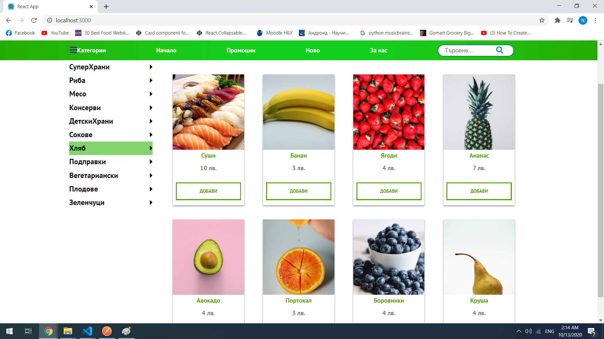
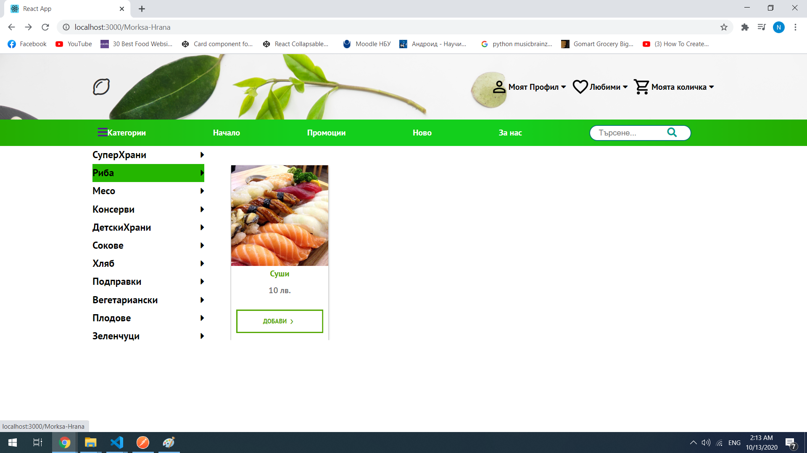
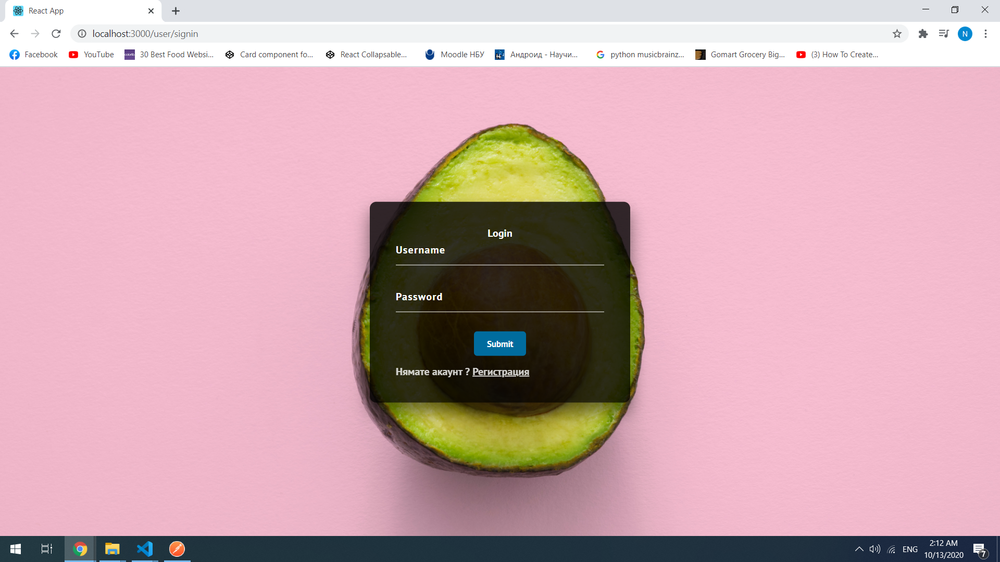
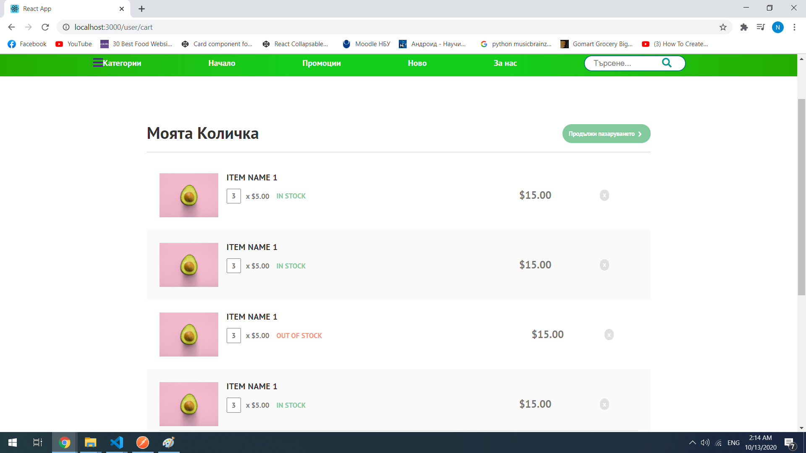
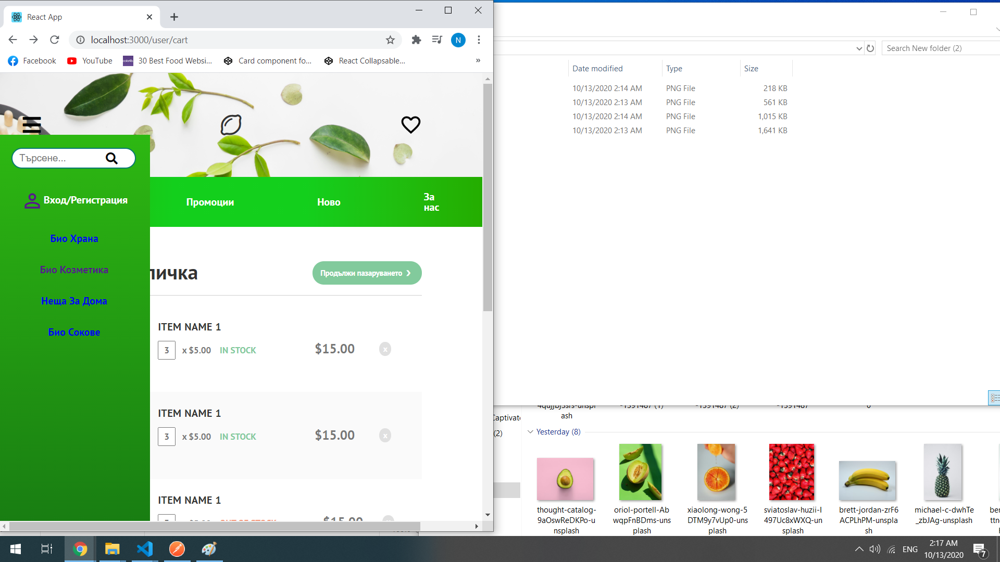
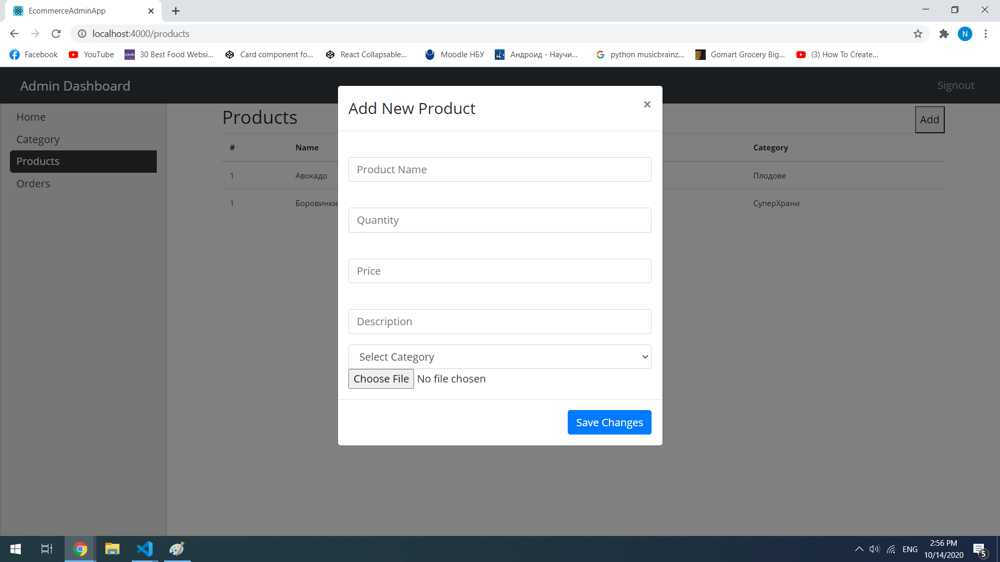
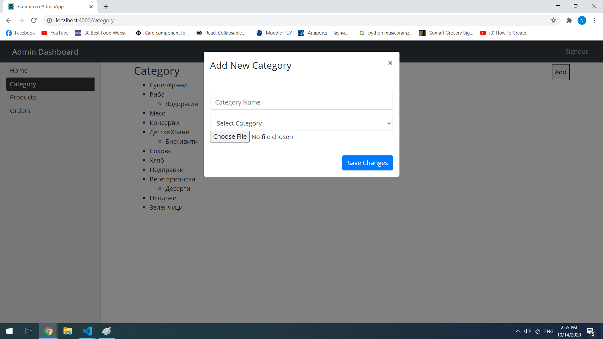

## Usage
Product images are on my local storage - in order to see product images you need to run the admin app and create new products with new images.

## Visualization








## Installation

Run this command for every folder

```bash
npm install
```
and then
```bash
npm start
```
